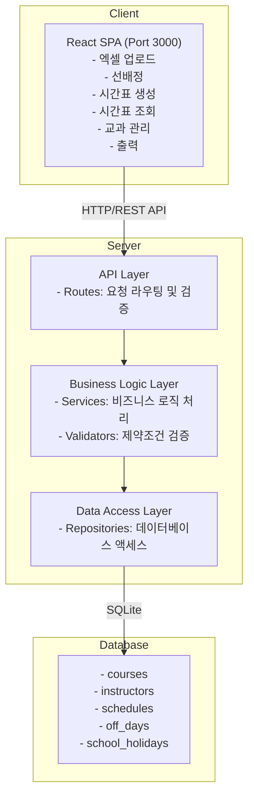

# 교육 과정 시간표 자동 생성 시스템

> 사이버 정보 체계 운용 초급반 교육 과정의 시간표를 자동으로 생성하고 관리하는 웹 기반 시스템

[](https://opensource.org/licenses/ISC)
[](https://nodejs.org/)
[](https://reactjs.org/)
[](https://www.typescriptlang.org/)

## 📋 목차

- [프로젝트 개요](#-프로젝트-개요)
- [주요 기능](#-주요-기능)
- [시스템 아키텍처](#-시스템-아키텍처)
- [기술 스택](#-기술-스택)
- [시작하기](#-시작하기)
- [사용 방법](#-사용-방법)
- [API 문서](#-api-문서)
- [프로젝트 구조](#-프로젝트-구조)
- [개발 가이드](#-개발-가이드)
- [문제 해결](#-문제-해결)
- [기여하기](#-기여하기)
- [라이선스](#-라이선스)

## 🎯 프로젝트 개요

교육 과정 시간표 자동 생성 시스템은 교육 기관에서 복잡한 제약 조건을 고려하여 최적의 시간표를 자동으로 생성하는 웹 애플리케이션입니다.

### 해결하는 문제

- ✅ 수동 시간표 작성의 시간 소모 문제
- ✅ 교관 휴무일, 교시 제한 등 복잡한 제약 조건 관리
- ✅ 시간표 충돌 및 오류 방지
- ✅ 시간표 수정 및 재배정의 어려움
- ✅ 시간표 공유 및 출력의 불편함

### 핵심 가치

- **자동화**: 엑셀 파일 업로드만으로 전체 시간표 자동 생성
- **유연성**: 선배정 및 수동 수정 기능으로 세밀한 조정 가능
- **정확성**: 제약 조건 검증으로 충돌 없는 시간표 보장
- **편의성**: 직관적인 UI와 다양한 조회 옵션 제공
- **효율성**: PDF 출력 및 교과목별 통계 제공

## ✨ 주요 기능

### 1. 엑셀 파일 업로드
- 교과목 정보가 담긴 엑셀 파일을 업로드하여 데이터베이스에 자동 저장
- 필수 컬럼: 구분, 과목, 시수, 담당교관, 선배정, 평가
- 실시간 파싱 결과 미리보기

### 2. 교과목 관리
- 교과목 목록 조회, 추가, 수정, 삭제
- 검색 및 필터링 기능
- 교과목별 상세 정보 관리

### 3. 선배정 기능
- 특정 교과목을 원하는 날짜와 시간에 수동으로 미리 배정
- 캘린더 기반 직관적인 UI
- 시수 일치 및 충돌 검증
- 날짜 범위 선택 지원

### 4. 자동 시간표 생성
- 제약 조건을 만족하는 최적의 시간표 자동 생성
- 주요 제약 조건:
  - 일과시간 준수 (월~수: 9교시, 목: 8교시, 금: 5교시)
  - 하루 최대 3시간 제한
  - 연속 3시간 이상 연강 방지
  - 교관 휴무일 회피
  - 선배정 시간 보존
  - 평가 자동 배정 (교과목 완료 후 다음날 2시간)

### 5. 시간표 조회
- **월별 뷰**: 전체 월 단위 캘린더 형식
- **주별 뷰**: 주간 교시별 상세 시간표
- **일별 뷰**: 일일 교시별 상세 시간표
- **교관별 뷰**: 특정 교관의 전체 시간표 조회

### 6. 시간표 수정
- 생성된 시간표를 수동으로 수정
- 드래그 앤 드롭 또는 모달 기반 수정
- 실시간 충돌 검증
- 수정 이력 관리

### 7. 교관 관리
- 교관 휴무일 등록 및 관리
- 날짜 범위 선택 지원
- 휴무일 목록 조회 및 삭제

### 8. 휴관일 관리
- 학교 전체 휴관일 등록
- 휴관일에는 자동으로 시간표 생성 차단
- 날짜 및 기간 선택 지원

### 9. 시간표 출력
- PDF 다운로드 기능
- 주간 단위 표 형식 출력
- 교과목별 배정시간 요약 포함
- A4 가로 형식 최적화

## 🏗 시스템 아키텍처



## 🛠 기술 스택

### Backend
| 기술 | 버전 | 용도 |
|------|------|------|
| Node.js | 18+ | 서버 런타임 |
| Express | 4.x | 웹 프레임워크 |
| TypeScript | 5.x | 타입 안정성 |
| SQLite | 3 | 데이터베이스 |
| xlsx | 0.18+ | 엑셀 파일 파싱 |
| multer | 1.4+ | 파일 업로드 |
| date-fns | 2.30+ | 날짜 처리 |

### Frontend
| 기술 | 버전 | 용도 |
|------|------|------|
| React | 18.x | UI 라이브러리 |
| TypeScript | 5.x | 타입 안정성 |
| Vite | 5.x | 빌드 도구 |
| React Router | 6.x | 라우팅 |
| Axios | 1.6+ | HTTP 클라이언트 |
| FullCalendar | 6.x | 캘린더 UI |
| jsPDF | 2.5+ | PDF 생성 |
| html2canvas | 1.4+ | HTML to Canvas |
| date-fns | 2.30+ | 날짜 처리 |

## 🚀 시작하기

### 사전 요구사항

다음 소프트웨어가 설치되어 있어야 합니다:

- **Node.js** 18.0.0 이상
- **npm** 9.0.0 이상
- **Git** (프로젝트 클론용)

### 설치 방법

#### 1. 저장소 클론

```bash
git clone https://github.com/your-username/course-schedule-generator.git
cd course-schedule-generator
```

#### 2. 백엔드 설정

```bash
# 백엔드 디렉토리로 이동
cd backend

# 의존성 설치
npm install

# 환경변수 파일 생성
cp .env.example .env

# 데이터베이스 초기화
npm run init-db

# 개발 서버 실행
npm run dev
```

백엔드 서버가 http://localhost:5000 에서 실행됩니다.

#### 3. 프론트엔드 설정

새 터미널을 열고:

```bash
# 프론트엔드 디렉토리로 이동
cd frontend

# 의존성 설치
npm install

# 환경변수 파일 생성
cp .env.example .env

# 개발 서버 실행
npm run dev
```

프론트엔드가 http://localhost:3000 에서 실행됩니다.

### Windows 사용자를 위한 간편 실행

프로젝트 루트에서 배치 파일을 실행하세요:

```bash
# 초기 설정 (최초 1회만)
setup.bat

# 개발 서버 실행
start-dev.bat
```

### 데이터베이스 초기화

기존 데이터를 삭제하고 새로 시작하려면:

```bash
cd backend
npm run init-db
```

또는 데이터베이스 파일을 직접 삭제:

```bash
# Windows
del backend\data\schedule.db

# Mac/Linux
rm backend/data/schedule.db
```

## 📖 사용 방법

### 1단계: 엑셀 파일 준비

교과목 정보가 담긴 엑셀 파일을 준비합니다. 필수 컬럼:

| 컬럼명 | 설명 | 예시 |
|--------|------|------|
| 구분 | 교과목 구분 | 전투체력, 전투기술 |
| 과목 | 교과목명 | 사격술, 전투체력 |
| 시수 | 수업 시간 | 10, 20 |
| 담당교관 | 교관 이름 | 홍길동, 김철수 |
| 선배정 | 선배정 여부 (1 또는 2) | 1=선배정, 2=자동배정 |
| 평가 | 평가 여부 (1 또는 공백) | 1=평가있음 |

샘플 파일: `subjects.xlsx` 또는 `과목.xlsx` 참조

### 2단계: 엑셀 업로드

1. 웹 브라우저에서 http://localhost:3000 접속
2. 상단 메뉴에서 **"엑셀 업로드"** 클릭
3. 준비한 엑셀 파일 선택 및 업로드
4. 파싱 결과 확인

### 3단계: 선배정 (선택사항)

선배정 값이 1인 교과목을 미리 배정:

1. **"선배정"** 메뉴 클릭
2. 왼쪽 목록에서 교과목 선택
3. 캘린더에서 원하는 날짜와 시간 선택
4. **"배정하기"** 버튼 클릭

### 4단계: 교관 휴무일 등록 (선택사항)

1. **"교관 관리"** 메뉴 클릭
2. 교관 선택
3. 휴무일 날짜 선택 및 추가

### 5단계: 휴관일 등록 (선택사항)

1. **"휴관일 관리"** 메뉴 클릭
2. 휴관일 날짜 또는 기간 선택
3. 설명 입력 및 저장

### 6단계: 시간표 자동 생성

1. **"시간표 생성"** 메뉴 클릭
2. 시작 날짜 선택
3. **"시간표 생성"** 버튼 클릭
4. 생성 완료 대기 (수초~수분 소요)

### 7단계: 시간표 조회 및 수정

1. **"시간표 조회"** 메뉴 클릭
2. 월별/주별/일별 뷰 선택
3. 필요시 일정 클릭하여 수정

### 8단계: 시간표 출력

1. **"시간표 출력"** 메뉴 클릭
2. 출력할 날짜 범위 선택
3. **"PDF 다운로드"** 버튼 클릭
4. 생성된 PDF 파일 확인

## 📡 API 문서

### 교과목 관리

```http
# 엑셀 업로드
POST /api/upload
Content-Type: multipart/form-data
Body: file (Excel file)

# 교과목 목록 조회
GET /api/courses?preAssignment=1

# 교과목 수정
PUT /api/courses/:id
Body: { 구분, 과목, 시수, 담당교관, 선배정, 평가 }

# 교과목 삭제
DELETE /api/courses/:id
```

### 시간표 관리

```http
# 시간표 자동 생성
POST /api/generate-schedule
Body: { startDate: "2024-01-01" }

# 시간표 조회
GET /api/schedules?startDate=2024-01-01&endDate=2024-01-31

# 선배정 생성
POST /api/schedules
Body: { courseId, date, startPeriod, endPeriod, instructorId }

# 시간표 수정
PUT /api/schedules/:id
Body: { date, startPeriod, endPeriod }

# 시간표 삭제
DELETE /api/schedules/:id
```

### 교관 관리

```http
# 교관 목록 조회
GET /api/instructors

# 휴무일 조회
GET /api/off-days?instructorId=1

# 휴무일 추가
POST /api/off-days
Body: { instructorId, date }

# 휴무일 삭제
DELETE /api/off-days/:id
```

### 휴관일 관리

```http
# 휴관일 목록 조회
GET /api/school-holidays

# 휴관일 추가
POST /api/school-holidays
Body: { startDate, endDate, description }

# 휴관일 삭제
DELETE /api/school-holidays/:id
```

## 📁 프로젝트 구조

```
course-schedule-generator/
├── backend/                    # 백엔드 서버
│   ├── src/
│   │   ├── database/          # 데이터베이스 설정
│   │   │   ├── connection.ts  # SQLite 연결
│   │   │   └── schema.ts      # 테이블 스키마
│   │   ├── repositories/      # 데이터 액세스 레이어
│   │   │   ├── CourseRepository.ts
│   │   │   ├── InstructorRepository.ts
│   │   │   ├── ScheduleRepository.ts
│   │   │   ├── OffDayRepository.ts
│   │   │   └── SchoolHolidayRepository.ts
│   │   ├── services/          # 비즈니스 로직
│   │   │   ├── ScheduleGenerator.ts      # 시간표 생성 알고리즘
│   │   │   ├── CourseAssigner.ts         # 교과목 배정
│   │   │   ├── ConstraintValidator.ts    # 제약조건 검증
│   │   │   └── PreAssignmentValidator.ts # 선배정 검증
│   │   ├── routes/            # API 라우트
│   │   │   ├── upload.ts      # 파일 업로드
│   │   │   ├── course.ts      # 교과목 관리
│   │   │   ├── schedule.ts    # 시간표 관리
│   │   │   ├── instructor.ts  # 교관 관리
│   │   │   ├── offDay.ts      # 휴무일 관리
│   │   │   └── schoolHoliday.ts # 휴관일 관리
│   │   ├── middleware/        # Express 미들웨어
│   │   │   └── errorHandler.ts
│   │   ├── errors/            # 커스텀 에러
│   │   ├── types/             # TypeScript 타입
│   │   │   └── models.ts
│   │   └── index.ts           # 서버 진입점
│   ├── data/                  # SQLite 데이터베이스
│   │   └── schedule.db
│   ├── uploads/               # 업로드된 파일
│   ├── package.json
│   ├── tsconfig.json
│   └── .env.example
│
├── frontend/                   # 프론트엔드 앱
│   ├── src/
│   │   ├── pages/             # 페이지 컴포넌트
│   │   │   ├── UploadPage.tsx           # 엑셀 업로드
│   │   │   ├── CourseManagementPage.tsx # 교과목 관리
│   │   │   ├── PreAssignmentPage.tsx    # 선배정
│   │   │   ├── ScheduleGenerationPage.tsx # 시간표 생성
│   │   │   ├── ScheduleViewPage.tsx     # 시간표 조회
│   │   │   ├── InstructorSchedulePage.tsx # 교관별 시간표
│   │   │   ├── InstructorOffDayPage.tsx # 교관 휴무일
│   │   │   ├── SchoolHolidayPage.tsx    # 휴관일 관리
│   │   │   └── SchedulePrintPage.tsx    # 시간표 출력
│   │   ├── components/        # 재사용 컴포넌트
│   │   │   ├── Layout.tsx     # 레이아웃
│   │   │   ├── MonthlyView.tsx # 월별 뷰
│   │   │   ├── WeeklyView.tsx  # 주별 뷰
│   │   │   ├── DailyView.tsx   # 일별 뷰
│   │   │   ├── TimeSlotModal.tsx # 시간 선택 모달
│   │   │   ├── ScheduleEditModal.tsx # 시간표 수정 모달
│   │   │   ├── ErrorNotification.tsx # 에러 알림
│   │   │   └── GlobalLoading.tsx # 로딩 인디케이터
│   │   ├── services/          # API 클라이언트
│   │   │   ├── api.ts         # Axios 인스턴스
│   │   │   ├── courseService.ts
│   │   │   ├── scheduleService.ts
│   │   │   └── instructorService.ts
│   │   ├── contexts/          # React Context
│   │   │   └── LoadingContext.tsx
│   │   ├── utils/             # 유틸리티
│   │   │   ├── errorHandler.ts
│   │   │   ├── colorUtils.ts
│   │   │   └── scheduleConfig.ts
│   │   ├── styles/            # 전역 스타일
│   │   │   ├── global.css
│   │   │   ├── variables.css
│   │   │   └── responsive.css
│   │   ├── App.tsx            # 메인 앱
│   │   └── main.tsx           # 진입점
│   ├── public/                # 정적 파일
│   ├── package.json
│   ├── tsconfig.json
│   ├── vite.config.ts
│   └── .env.example
│
├── .kiro/                      # Kiro IDE 설정
│   └── specs/                 # 프로젝트 스펙
│       └── course-schedule-generator/
│           ├── requirements.md # 요구사항
│           ├── design.md      # 설계 문서
│           └── tasks.md       # 작업 목록
│
├── README.md                   # 프로젝트 문서
├── PROJECT_STRUCTURE.md        # 구조 설명
├── setup.bat                   # Windows 설정 스크립트
├── start-dev.bat              # Windows 실행 스크립트
└── subjects.xlsx              # 샘플 엑셀 파일
```

## 💻 개발 가이드

### 개발 환경 설정

#### VS Code 추천 확장

- ESLint
- Prettier
- TypeScript Vue Plugin (Volar)
- SQLite Viewer

#### 코드 스타일

프로젝트는 ESLint와 Prettier를 사용합니다:

```bash
# 린트 검사
npm run lint

# 자동 수정
npm run lint -- --fix
```

### 개발 스크립트

#### 백엔드

```bash
# 개발 서버 (hot reload)
npm run dev

# TypeScript 컴파일
npm run build

# 프로덕션 서버
npm start

# 데이터베이스 초기화
npm run init-db

# 데이터베이스 검증
npm run verify-db

# 테스트 스크립트 실행
node test-*.js
```

#### 프론트엔드

```bash
# 개발 서버
npm run dev

# 프로덕션 빌드
npm run build

# 빌드 미리보기
npm run preview

# 린트 검사
npm run lint
```

### 데이터베이스 스키마

#### courses 테이블
```sql
CREATE TABLE courses (
  id INTEGER PRIMARY KEY AUTOINCREMENT,
  구분 TEXT NOT NULL,
  과목 TEXT NOT NULL,
  시수 INTEGER NOT NULL,
  담당교관 TEXT NOT NULL,
  선배정 INTEGER NOT NULL CHECK(선배정 IN (1, 2)),
  평가 TEXT,
  excel_order INTEGER NOT NULL,
  created_at DATETIME DEFAULT CURRENT_TIMESTAMP
);
```

#### schedules 테이블
```sql
CREATE TABLE schedules (
  id INTEGER PRIMARY KEY AUTOINCREMENT,
  course_id INTEGER NOT NULL,
  instructor_id INTEGER NOT NULL,
  date TEXT NOT NULL,
  start_period INTEGER NOT NULL,
  end_period INTEGER NOT NULL,
  is_pre_assigned BOOLEAN DEFAULT 0,
  is_exam BOOLEAN DEFAULT 0,
  created_at DATETIME DEFAULT CURRENT_TIMESTAMP,
  FOREIGN KEY (course_id) REFERENCES courses(id) ON DELETE CASCADE,
  FOREIGN KEY (instructor_id) REFERENCES instructors(id) ON DELETE CASCADE
);
```

#### instructors 테이블
```sql
CREATE TABLE instructors (
  id INTEGER PRIMARY KEY AUTOINCREMENT,
  name TEXT NOT NULL UNIQUE,
  created_at DATETIME DEFAULT CURRENT_TIMESTAMP
);
```

#### off_days 테이블
```sql
CREATE TABLE off_days (
  id INTEGER PRIMARY KEY AUTOINCREMENT,
  instructor_id INTEGER NOT NULL,
  date TEXT NOT NULL,
  created_at DATETIME DEFAULT CURRENT_TIMESTAMP,
  FOREIGN KEY (instructor_id) REFERENCES instructors(id) ON DELETE CASCADE,
  UNIQUE(instructor_id, date)
);
```

#### school_holidays 테이블
```sql
CREATE TABLE school_holidays (
  id INTEGER PRIMARY KEY AUTOINCREMENT,
  start_date TEXT NOT NULL,
  end_date TEXT NOT NULL,
  description TEXT,
  created_at DATETIME DEFAULT CURRENT_TIMESTAMP
);
```

### 시간표 생성 알고리즘

시스템은 Greedy 알고리즘을 사용하여 시간표를 생성합니다:

1. **초기화**: 선배정된 시간표를 TimeSlot 배열에 반영
2. **정렬**: 선배정=2인 교과목을 excel_order 순으로 정렬
3. **순차 배정**: 각 교과목을 제약 조건을 만족하는 첫 번째 가능한 시간에 배정
4. **제약 검증**:
   - 일과시간 내 배정
   - 하루 최대 3시간 제한
   - 연속 3시간 이상 연강 방지
   - 교관 휴무일 회피
   - 휴관일 회피
   - 시간 충돌 방지
5. **평가 배정**: 평가=1인 교과목 완료 후 다음날 2시간 자동 배정

### 환경 변수

#### 백엔드 (.env)
```env
PORT=5000
DATABASE_PATH=./data/schedule.db
UPLOAD_DIR=./uploads
MAX_FILE_SIZE=10485760
NODE_ENV=development
```

#### 프론트엔드 (.env)
```env
VITE_API_URL=http://localhost:5000/api
```

## 🔧 문제 해결

### 일반적인 문제

#### 1. 포트가 이미 사용 중입니다

**증상**: `Error: listen EADDRINUSE: address already in use :::5000`

**해결방법**:
```bash
# Windows
netstat -ano | findstr :5000
taskkill /PID <PID> /F

# Mac/Linux
lsof -ti:5000 | xargs kill -9
```

또는 .env 파일에서 다른 포트 사용:
```env
PORT=5001
```

#### 2. 데이터베이스 파일을 찾을 수 없습니다

**증상**: `Error: SQLITE_CANTOPEN: unable to open database file`

**해결방법**:
```bash
cd backend
npm run init-db
```

#### 3. 모듈을 찾을 수 없습니다

**증상**: `Error: Cannot find module 'xxx'`

**해결방법**:
```bash
# 의존성 재설치
rm -rf node_modules package-lock.json
npm install
```

#### 4. TypeScript 컴파일 오류

**증상**: `TS2307: Cannot find module`

**해결방법**:
```bash
# TypeScript 재컴파일
npm run build
```

#### 5. CORS 오류

**증상**: `Access to XMLHttpRequest has been blocked by CORS policy`

**해결방법**:
- 백엔드 .env에서 CORS 설정 확인
- 프론트엔드 .env에서 API URL 확인

#### 6. PDF 생성 오류

**증상**: `Cannot find module 'jspdf'`

**해결방법**:
```bash
cd frontend
npm install jspdf html2canvas
npm install --save-dev @types/html2canvas
```

### 데이터베이스 관련

#### 데이터베이스 초기화

```bash
cd backend
npm run init-db
```

#### 데이터베이스 백업

```bash
# Windows
copy backend\data\schedule.db backend\data\schedule_backup.db

# Mac/Linux
cp backend/data/schedule.db backend/data/schedule_backup.db
```

#### 데이터베이스 복원

```bash
# Windows
copy backend\data\schedule_backup.db backend\data\schedule.db

# Mac/Linux
cp backend/data/schedule_backup.db backend/data/schedule.db
```

### 성능 최적화

#### 대량 데이터 처리

교과목이 많은 경우 시간표 생성에 시간이 걸릴 수 있습니다:

- 선배정을 최소화하여 자동 생성 효율 향상
- 교관 휴무일을 정확히 입력하여 불필요한 재시도 방지
- 데이터베이스 인덱스 확인

#### 프론트엔드 최적화

```bash
# 프로덕션 빌드
cd frontend
npm run build

# 빌드된 파일은 dist/ 디렉토리에 생성됨
```

## 🤝 기여하기

프로젝트에 기여하고 싶으시다면:

1. Fork the Project
2. Create your Feature Branch (`git checkout -b feature/AmazingFeature`)
3. Commit your Changes (`git commit -m 'Add some AmazingFeature'`)
4. Push to the Branch (`git push origin feature/AmazingFeature`)
5. Open a Pull Request

### 코딩 컨벤션

- TypeScript 사용
- ESLint 규칙 준수
- 의미 있는 변수명 사용
- 함수는 단일 책임 원칙 준수
- 주석은 한글로 작성

### 커밋 메시지 규칙

```
feat: 새로운 기능 추가
fix: 버그 수정
docs: 문서 수정
style: 코드 포맷팅
refactor: 코드 리팩토링
test: 테스트 코드
chore: 빌드 업무 수정
```

## 📝 라이선스

이 프로젝트는 ISC 라이선스를 따릅니다. 자세한 내용은 [LICENSE](LICENSE) 파일을 참조하세요.

## 📞 문의

프로젝트에 대한 질문이나 제안사항이 있으시면:

- Issue 생성: [GitHub Issues](https://github.com/your-username/course-schedule-generator/issues)
- Email: your-email@example.com

## 🙏 감사의 말

이 프로젝트는 다음 오픈소스 라이브러리를 사용합니다:

- [React](https://reactjs.org/)
- [Express](https://expressjs.com/)
- [FullCalendar](https://fullcalendar.io/)
- [jsPDF](https://github.com/parallax/jsPDF)
- [SQLite](https://www.sqlite.org/)

---

**Made with ❤️ for Education**
